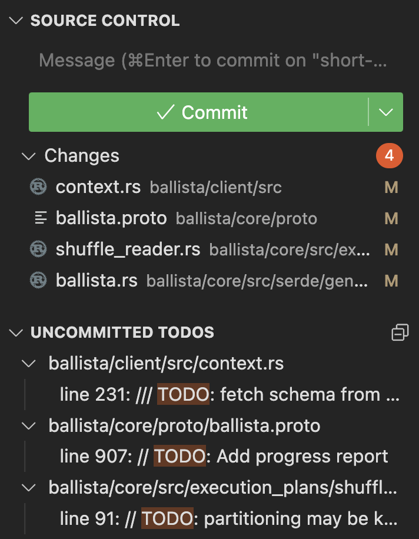

GiToDo is a small extension that will show you all lines with uncomitted changes that contain a TODO.

## Requirements

`git` must be available as a command.

## Extension Settings

Currently, no settings are available.

## Known Issues

No known issues.

## Release Notes

### 0.0.1

Initial release.
